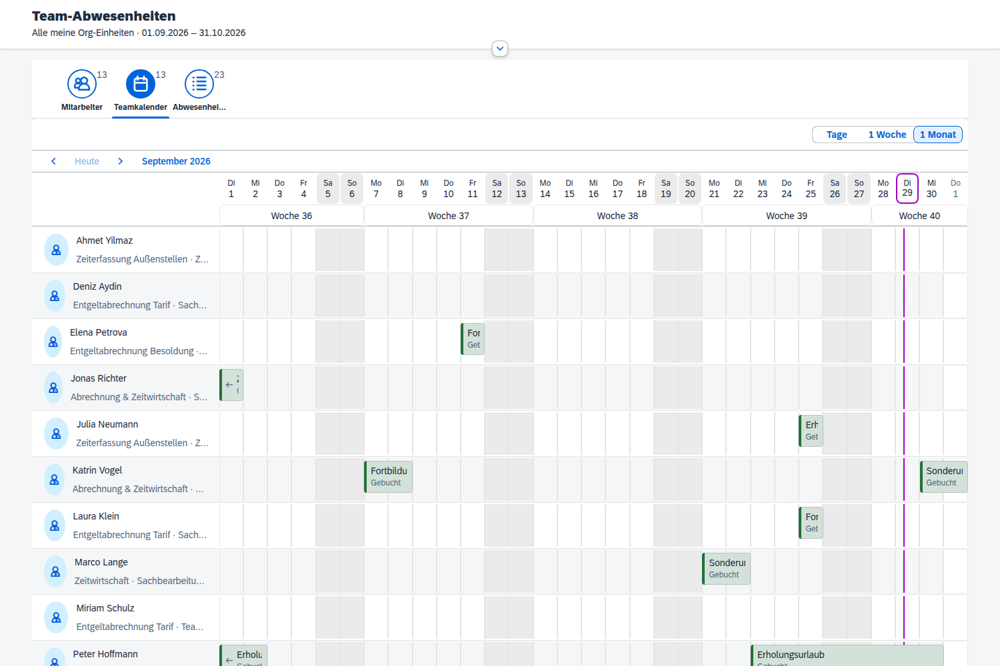

# Team-Abwesenheiten (Fiori)

Eine Fiori-App für Führungskräfte: Mitarbeiter aus der **eigenen Org-Hierarchie** auswählen
und ihre **geplanten Abwesenheiten** anzeigen – so wie im Teamkalender der Transaktion `PTARQ`,
nur im Browser bzw. im Fiori Launchpad.



## Was die App kann

| Bereich | Inhalt |
|---|---|
| **Selektion** | Org-Einheiten aus der eigenen Hierarchie (Baum-Auswahl), Untereinheiten ein/aus, Zeitraum, Status, Suche nach Name/Personalnummer |
| **Mitarbeiter** | Liste aller Mitarbeiter der gewählten Org-Einheiten mit Abwesenheitstagen im Zeitraum. Mehrfachauswahl – der Kalender zeigt dann nur diese Personen |
| **Teamkalender** | `PlanningCalendar` mit Tages-, Wochen- und Monatsansicht, farbig nach Status, Klick auf eine Abwesenheit öffnet die Details |
| **Liste** | Alle Abwesenheiten tabellarisch, Excel-Export |

Angezeigt werden – wie in PTARQ:

| Status | Quelle | Farbe |
|---|---|---|
| Gebucht | Infotyp 2001 | grün |
| Genehmigt, noch nicht gebucht | Abwesenheitsantrag (`PTREQ_*`, Status `APPROVED`) | blau |
| Beantragt, wartet auf Genehmigung | Abwesenheitsantrag (`PTREQ_*`, Status `SENT`) | orange |

Abgelehnte, zurückgezogene und gelöschte Anträge werden nicht angezeigt. Gebuchte Anträge
tauchen nur einmal auf (über IT2001).

## Aufbau

```
backend/src/          ABAP (abapGit-Format, Paket ZHR_TEAMABS)
  zif_hr_teamabs_types      Typen
  zcl_hr_teamabs_org        eigene Org-Hierarchie + Mitarbeiter
  zcl_hr_teamabs_absences   IT2001 + Abwesenheitsanträge lesen
  zcl_hr_teamabs_mpc        OData-Modell (im Code, ohne SEGW)
  zcl_hr_teamabs_dpc        OData-Datenprovider
app/                  SAPUI5-Frontend (Freestyle, OData V2)
  webapp/view/Main.view.xml        Filterleiste, Mitarbeiter, Kalender, Liste
  webapp/controller/Main.controller.js
  webapp/localService/             Metadaten + Mockserver zum lokalen Testen
```

### Wie „eigene Org-Hierarchie" ermittelt wird

1. Angemeldeter Benutzer → Personalnummer über **IT0105 Subtyp 0001**
2. Personalnummer → geführte Org-Einheiten über den Auswertungsweg **`SAP_MANG`**
   (Person → Planstelle → Org-Einheit über Verknüpfung **A012 „leitet"**)
3. Je geführter Org-Einheit alle Untereinheiten über den Auswertungsweg **`ORGEH`**
4. Mitarbeiter = aktive Personen (IT0000 `STAT2 = 3`) mit IT0001-`ORGEH` in dieser Menge

Der OData-Service prüft das **bei jeder Anfrage selbst**. Schickt das Frontend eine fremde
Org-Einheit oder Personalnummer, gibt es eine Fehlermeldung bzw. die Person wird einfach
ausgefiltert. Wer keine Org-Einheit leitet, sieht nichts (die App zeigt dann einen Hinweis).

## OData-Service `ZHR_TEAMABS_SRV`

| Entitätsmenge | Filter | Beispiel |
|---|---|---|
| `OrgUnits` | – | `/OrgUnits` |
| `Employees` | `Orgeh eq`, `Pernr eq`, `search=` | `/Employees?$filter=Orgeh eq '50000110'` |
| `Absences` | `Pernr eq`, `EndDate ge`, `BeginDate le`, `Status eq` | `/Absences?$filter=Pernr eq '00001011' and EndDate ge datetime'2026-09-01T00:00:00' and BeginDate le datetime'2026-10-31T00:00:00'` |

Ohne Zeitraum liefert `Absences` den laufenden Monat, der Zeitraum ist auf 400 Tage begrenzt.

## Installation Backend

Voraussetzungen: SAP ERP HCM oder S/4HANA mit HCM, SAP Gateway (ab NetWeaver 7.40 SP08),
OM-Integration aktiv, Leiter über A012 gepflegt, IT0105/0001 für die Führungskräfte gepflegt.

1. **Objekte anlegen** – am einfachsten per [abapGit](https://abapgit.org) dieses Repo in das Paket
   `ZHR_TEAMABS` ziehen (Startordner `/backend/src/` steht in `.abapgit.xml`).
   Alternativ Interface und Klassen per SE24/ADT anlegen und den Code hineinkopieren.
2. **Modell registrieren** – Transaktion `/IWBEP/REG_MODEL`
   - Technischer Modellname: `ZHR_TEAMABS_MDL`, Version `1`
   - Modell-Provider-Klasse: `ZCL_HR_TEAMABS_MPC`
3. **Service registrieren** – Transaktion `/IWBEP/REG_SERVICE`
   - Technischer Servicename: `ZHR_TEAMABS_SRV`, Version `1`
   - Data-Provider-Klasse: `ZCL_HR_TEAMABS_DPC`
   - Modell `ZHR_TEAMABS_MDL` / `1` zuordnen
4. **Service aktivieren** – Transaktion `/IWFND/MAINT_SERVICE` → *Service hinzufügen*,
   Systemalias (bei Embedded-Deployment `LOCAL`), `ZHR_TEAMABS_SRV` auswählen.
5. **Testen** – Transaktion `/IWFND/GW_CLIENT`:
   `/sap/opu/odata/sap/ZHR_TEAMABS_SRV/$metadata`, danach `/OrgUnits` mit einem Leiter-Benutzer.

### Berechtigungen

- Die Führungskräfte brauchen `S_SERVICE` für `ZHR_TEAMABS_SRV` (Rolle über `/IWFND/MAINT_SERVICE` → *Rolle zuordnen*).
- Die HR-Daten werden **ohne** `P_ORGIN`-Prüfung gelesen. Die Einschränkung passiert allein über
  die Org-Hierarchie (so wie im MSS-Teamkalender). Falls ihr zusätzlich Infotyp-Berechtigungen
  prüfen wollt, ist `ZCL_HR_TEAMABS_ORG->GET_EMPLOYEES` die richtige Stelle.

### Datenschutz: Abwesenheitsarten maskieren

Krankheit, Kur usw. sollten Führungskräfte meist nicht im Klartext sehen. In `STVARV` eine
**Selektionsoption `ZHR_TEAMABS_AWART_MASK`** anlegen und die betroffenen Abwesenheitsarten
eintragen. Diese erscheinen dann nur als „Abwesend" – ohne Art. Bitte mit Datenschutz und
Personalrat abstimmen.

## Frontend

```bash
cd app
npm install
npm start               # lokal mit Mockdaten, ohne SAP-System
```

Gegen ein echtes Backend: in `app/ui5.yaml` URL und Mandant eintragen, dann `npm run start-backend`.

### In SAP Business Application Studio (BAS) testen

1. Dev Space vom Typ **SAP Fiori** anlegen und starten.
2. Repo klonen (*Clone from Git*) und den Ordner `app` öffnen (*File › Open Folder › …/app*).
3. Terminal: `npm install`, dann `npm start`. BAS meldet „A service is listening to port 8080“ →
   *Open in a New Tab*. Falls die Seite leer ist, `/test/mockServer.html` an die URL hängen.
4. Gegen das echte System: im BTP-Subaccount eine Destination anlegen (Name wie in `ui5.yaml`,
   Standard `HR_GATEWAY`), Typ HTTP, Proxy-Typ `OnPremise` über den Cloud Connector,
   Authentifizierung z. B. `PrincipalPropagation` oder `BasicAuthentication`, zusätzliche
   Eigenschaften `WebIDEEnabled=true`, `WebIDEUsage=odata_abap,dev_abap`, `HTML5.DynamicDestination=true`.
   Im Cloud Connector den Pfad `/sap/opu/odata` (und für das Deployment `/sap/bc/adt`) freigeben.
   Dann `npm run start-backend`.
5. Deployment aus BAS: `npm run deploy-test` (Probelauf), danach `npm run deploy`.

### Deployment und Launchpad

1. In `app/ui5-deploy.yaml` System, Paket und Transportauftrag eintragen.
2. `npm run deploy` legt die BSP-Anwendung `ZHR_TEAMABS` an (Test ohne Upload: `npm run deploy-test`).
3. Im Launchpad Designer bzw. `/UI2/FLPD_CUST`:
   - Zielzuordnung: semantisches Objekt `TeamAbsence`, Aktion `display`,
     Anwendungstyp SAPUI5, ID `zhr.teamabs`, URL `/sap/bc/ui5_ui5/sap/zhr_teamabs`
   - Kachel mit derselben Navigation, Symbol `sap-icon://general-leave-request`
   - Katalog + Gruppe/Bereich einer Führungskräfte-Rolle zuordnen

Mindestversion SAPUI5: 1.96. Benutzt werden `sap.m`, `sap.f`, `sap.ui.comp` (Filterleiste),
`sap.ui.unified` und `sap.ui.export`.

## Was ihr vor dem Produktivgang prüfen solltet

- **Abwesenheitsanträge** werden direkt aus `PTREQ_HEADER`, `PTREQ_ITEMS` und `PTREQ_ATTABSDATA`
  gelesen (aktuelle Version je Antrag, Positionen mit Operation `DEL` werden ignoriert).
  Das ist dieselbe Datenbasis wie `RPTARQDBVIEW`. Die Feldnamen stammen aus dem Standard – bitte
  trotzdem in SE11 gegen euer Release prüfen und mit ein paar echten Anträgen gegen PTARQ vergleichen.
- **Stichtag** für Org-Zuordnung und Hierarchie ist heute. Wer im gewählten Zeitraum erst
  später in den Bereich wechselt, taucht noch nicht auf.
- **„Abw.-Tage im Zeitraum"** in der Mitarbeiterliste: bei Abwesenheiten, die über den Zeitraum
  hinausgehen, zählt die App Mo–Fr im Zeitraum. Feiertage und Teilzeitmodelle sind dabei nicht
  berücksichtigt; die Spalte „Tage" in der Liste kommt dagegen direkt aus dem SAP.
- Wenn ein Leiter auch Untereinheiten mit eigener Leitung hat, sieht er deren Mitarbeiter mit
  (Haken „Untergeordnete Einheiten"). Wer das nicht will, entfernt den Haken oder schränkt den
  Auswertungsweg ein (`ZCL_HR_TEAMABS_ORG=>GC_WEGID_ORGTREE`).
